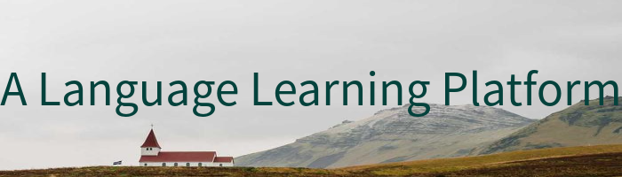
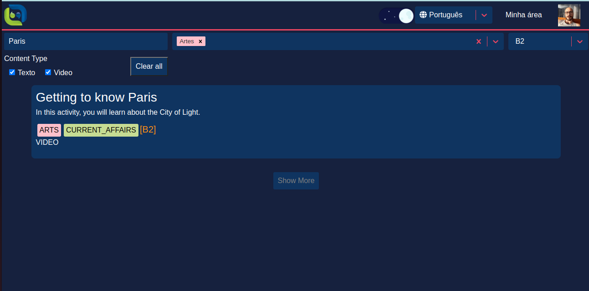
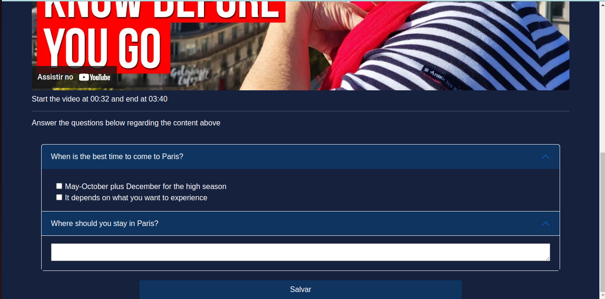
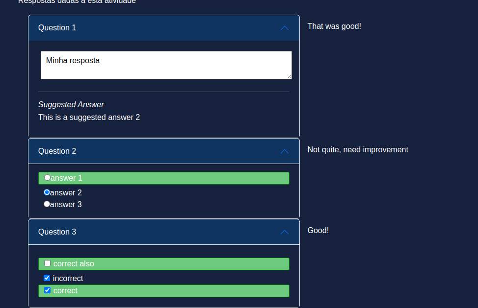
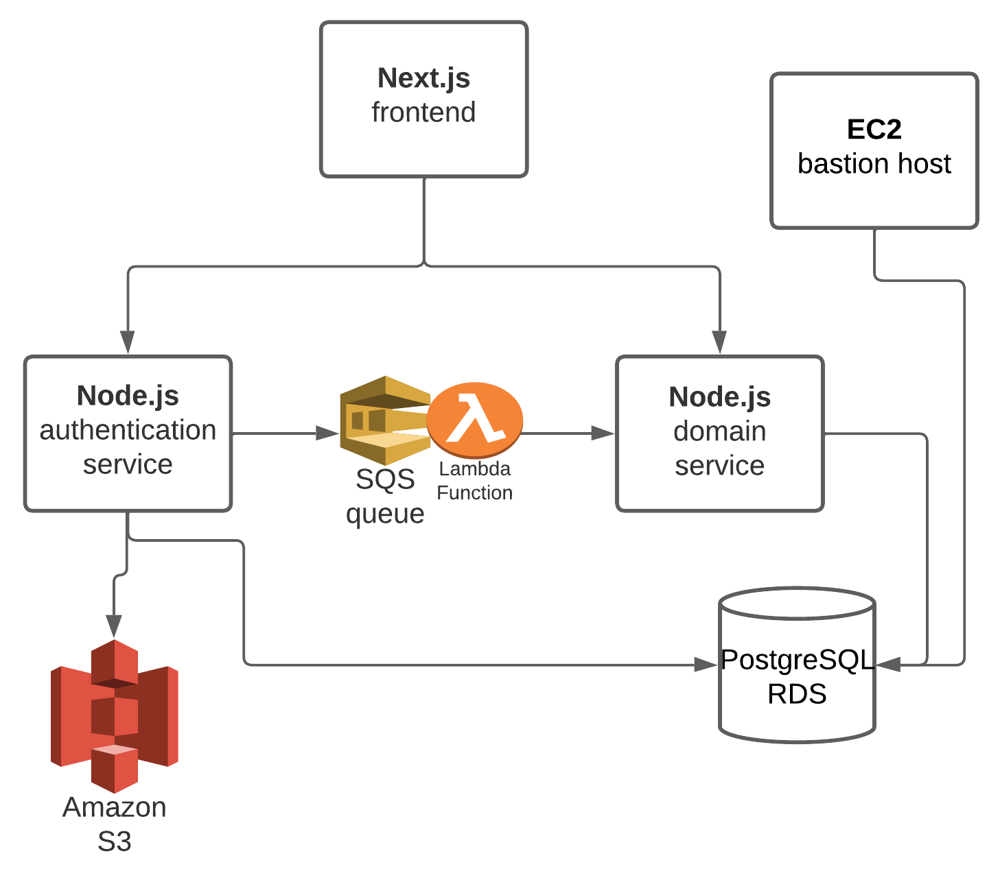
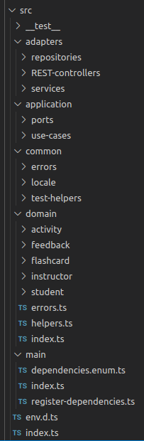

# Overview

This is my Computer Engineering senior thesis. I got my degree in 2022 from the University of São Paulo.

It is a language learning platform. Users can sign in as either instructors or students. Instructors will author language learning activities and students will complete them and get written feedback from their instructors.

Watch [this video](https://youtu.be/FuYyzwA2rWM) for a demonstration of how it works.

  
  
  
    
  
  
  
  

# Architecture

The app is designed as a client-server architecture with microsservices.

The frontend is in Next.js and deployed to Vercel.

The backend consists of two Node.js REST APIs, one that takes care of authentication and authorization and another one that does all the rest of the domain logic.

All of the backend is in AWS. Both applications are Dockerized and deployed by ECS (with Fargate). They communicate via SQS, and persist their data on a single (for cost purposes) instance of RDS running Postgre. S3 is used to store user profile pictures.

There is a bastion host inside the VPC which I can use to see the contents of the databases.

There are two CICD pipelines, one which builds the Docker images and deploys the backend applications to a staging environment after pushes to _develop_ and another one which deploys those containers to a production environment after pushes to _main_. Github actions run tasks which check for linting, formatting and run automated tests.

All of AWS infra is provisioned using Terraform (see the IaaC in _/infra_).

# Authentication and Authorization

The auth API takes care of all basic authentication funcionalities, such as sign up, sign in, change of passwords, verification of accounts, and change of profile pictures.

When a user signs in, the auth app returns a JWT token with the user's current token version (which starts at 0 on sign up). The token is stored on the browser and sent on all requests to the domain app, which will respond to requests only if the token is valid and its token version is the user's most current one.

When a user signs out, the auth app will increment the token version and send a message via the queue to the domain app, so that it persists the most current token version for that user. That allows me to invalidate and reject requests from all current sessions of a user.

# Frontend

It uses some version of [atomic design](https://atomicdesign.bradfrost.com/chapter-2/)

# Backend

## Clean Architecture

The code design closely follows [Clean Architecture](https://blog.cleancoder.com/uncle-bob/2012/08/13/the-clean-architecture.html)

## Platform Code

Neither application needs to define framework code, s
Since most dependencies, like the ones related to HTTP or AWS are shared, that code is treated as common [platform code](https://softwareengineeringdaily.com/2020/02/13/setting-the-stage-for-platform-engineering/).

# Infrastructure

## AWS and Terraform

# Development Experience

### Monorepo

### Developing Locally

### Pre-production and Production Environments

### CICD

# TODO

## Project Setup

- lint backend code

## Infrastructure

- AWS Distro and OTeL for observability
- Improve CICD to support selective builds

## Frontend
